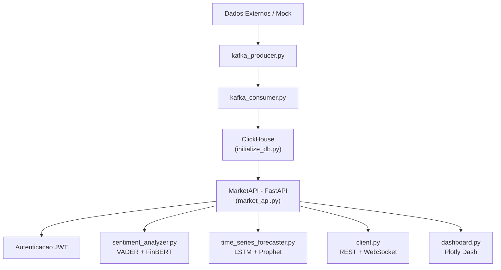
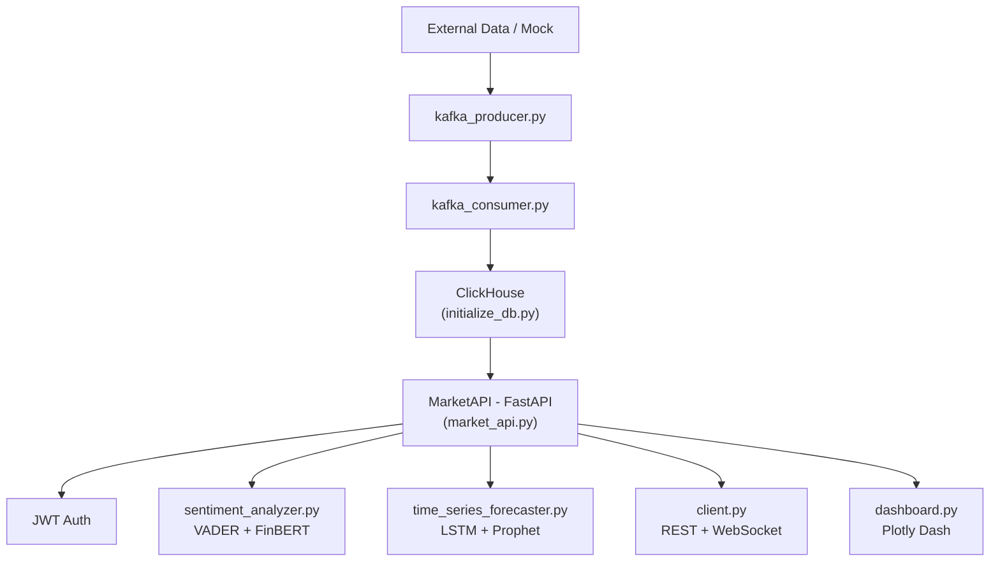

# Real-Time Market Intelligence

Plataforma de inteligência de mercado em tempo real com API REST, análise de sentimento NLP e previsão de séries temporais.

## Visão Geral

Este projeto reúne módulos Python para coleta, análise e visualização de dados de mercado financeiro:

- **API REST (FastAPI)** — endpoints autenticados (JWT/OAuth2) para dados de mercado, sentimento e previsões. Quando nenhum provedor de dados externo está configurado, retorna dados mock para demonstração.
- **Análise de Sentimento** — pipeline NLP com VADER (léxico), FinBERT (transformer) e ensemble ponderado para textos financeiros.
- **Previsão de Séries Temporais** — modelos LSTM (TensorFlow/Keras) e Prophet para previsão de preços.
- **Streaming Kafka** — produtor e consumidor usando `confluent-kafka` para ingestão de dados em tempo real.
- **Dashboard Plotly Dash** — painel interativo para visualização de preços, sentimento e previsões.
- **Cliente Python** — biblioteca cliente com suporte a REST e WebSocket para integração.

## Arquitetura



## Estrutura do Projeto

```
src/
├── api/
│   └── market_api.py          # API FastAPI com autenticação JWT
├── models/
│   ├── sentiment_analyzer.py  # VADER + FinBERT + ensemble
│   └── time_series_forecaster.py  # LSTM + Prophet
├── streaming/
│   ├── kafka_consumer.py      # Consumidor confluent-kafka
│   └── kafka_producer.py      # Produtor confluent-kafka
├── visualization/
│   └── dashboard.py           # Dashboard Plotly Dash
├── scripts/
│   └── initialize_db.py       # Esquema ClickHouse
├── utils/
│   └── logger.py              # Utilitário de logging
└── client.py                  # Cliente REST + WebSocket

tests/
└── test_main.py               # Testes funcionais (logger, API, auth, modelos)

notebooks/
├── prototypes/
│   └── sentiment-prototype.ipynb  # Protótipo de análise de sentimento
└── tutorials/
    └── api-client-usage.ipynb     # Tutorial de uso do cliente
```

## Pré-requisitos

- Python 3.10+
- (Opcional) Docker + Docker Compose para serviços de infraestrutura

## Instalação

```bash
pip install -r requirements.txt
```

Para NLP com FinBERT, o download do modelo acontece automaticamente na primeira execução via Hugging Face `transformers`.

## Uso

### Iniciar a API

```bash
# Variáveis de ambiente (opcionais, têm defaults para dev)
export JWT_SECRET_KEY="sua-chave-secreta"
export ADMIN_PASSWORD="senha-admin"

python -m uvicorn src.api.market_api:MarketAPI --factory --host 0.0.0.0 --port 8000
```

Ou diretamente:

```python
from src.api.market_api import MarketAPI

api = MarketAPI(secret_key="sua-chave-secreta")
api.run()
```

### Infraestrutura (Docker Compose)

O `docker-compose.yml` fornece ClickHouse, Kafka (com Zookeeper) e Redis:

```bash
docker-compose up -d
```

### Testes

```bash
python -m pytest tests/ -v
```

## Tecnologias

| Componente | Tecnologia |
|---|---|
| API | FastAPI, Pydantic v2, PyJWT |
| NLP | VADER (NLTK), FinBERT (transformers + PyTorch) |
| Previsão | LSTM (TensorFlow/Keras), Prophet |
| Streaming | confluent-kafka |
| Banco de Dados | ClickHouse |
| Cache | Redis |
| Visualização | Plotly, Dash |
| Cliente | requests, websocket-client |

## Licença

MIT

---

# Real-Time Market Intelligence

Real-time market intelligence platform with REST API, NLP sentiment analysis, and time series forecasting.

## Overview

This project brings together Python modules for collecting, analyzing, and visualizing financial market data:

- **REST API (FastAPI)** — JWT/OAuth2-authenticated endpoints for market data, sentiment, and forecasts. Falls back to mock data for demonstration when no external data provider is configured.
- **Sentiment Analysis** — NLP pipeline with VADER (lexicon), FinBERT (transformer), and weighted ensemble for financial texts.
- **Time Series Forecasting** — LSTM (TensorFlow/Keras) and Prophet models for price prediction.
- **Kafka Streaming** — producer and consumer using `confluent-kafka` for real-time data ingestion.
- **Plotly Dash Dashboard** — interactive panel for price, sentiment, and forecast visualization.
- **Python Client** — client library with REST and WebSocket support for integration.

## Architecture



## Project Structure

```
src/
├── api/
│   └── market_api.py          # FastAPI with JWT authentication
├── models/
│   ├── sentiment_analyzer.py  # VADER + FinBERT + ensemble
│   └── time_series_forecaster.py  # LSTM + Prophet
├── streaming/
│   ├── kafka_consumer.py      # confluent-kafka consumer
│   └── kafka_producer.py      # confluent-kafka producer
├── visualization/
│   └── dashboard.py           # Plotly Dash dashboard
├── scripts/
│   └── initialize_db.py       # ClickHouse schema setup
├── utils/
│   └── logger.py              # Logging utility
└── client.py                  # REST + WebSocket client

tests/
└── test_main.py               # Functional tests (logger, API, auth, models)

notebooks/
├── prototypes/
│   └── sentiment-prototype.ipynb  # Sentiment analysis prototype
└── tutorials/
    └── api-client-usage.ipynb     # Client usage tutorial
```

## Prerequisites

- Python 3.10+
- (Optional) Docker + Docker Compose for infrastructure services

## Installation

```bash
pip install -r requirements.txt
```

For NLP with FinBERT, the model downloads automatically on first run via Hugging Face `transformers`.

## Usage

### Start the API

```bash
# Environment variables (optional, have dev defaults)
export JWT_SECRET_KEY="your-secret-key"
export ADMIN_PASSWORD="admin-password"

python -m uvicorn src.api.market_api:MarketAPI --factory --host 0.0.0.0 --port 8000
```

Or directly:

```python
from src.api.market_api import MarketAPI

api = MarketAPI(secret_key="your-secret-key")
api.run()
```

### Infrastructure (Docker Compose)

The `docker-compose.yml` provides ClickHouse, Kafka (with Zookeeper), and Redis:

```bash
docker-compose up -d
```

### Tests

```bash
python -m pytest tests/ -v
```

## Technologies

| Component | Technology |
|---|---|
| API | FastAPI, Pydantic v2, PyJWT |
| NLP | VADER (NLTK), FinBERT (transformers + PyTorch) |
| Forecasting | LSTM (TensorFlow/Keras), Prophet |
| Streaming | confluent-kafka |
| Database | ClickHouse |
| Cache | Redis |
| Visualization | Plotly, Dash |
| Client | requests, websocket-client |

## License

MIT
