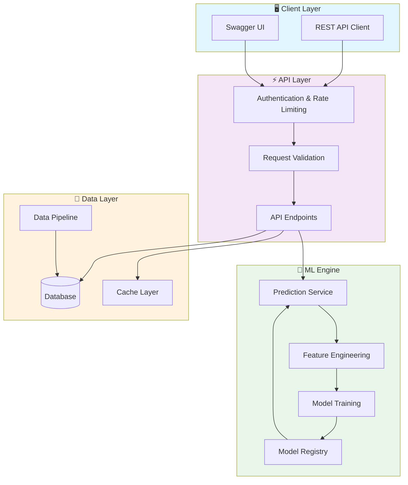
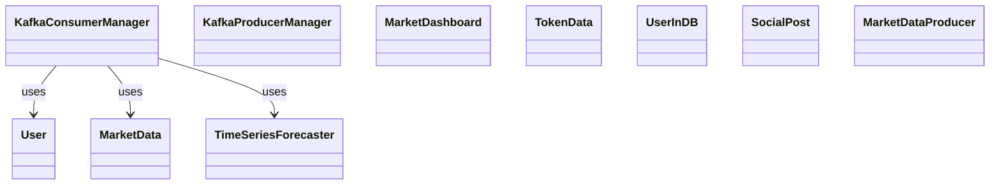

# 📈 Real Time Market Intelligence

> Advanced data science project: real-time-market-intelligence

[](https://img.shields.io/badge/)
[](https://img.shields.io/badge/)
[](https://img.shields.io/badge/)
[](https://img.shields.io/badge/)
[](https://img.shields.io/badge/)
[](https://img.shields.io/badge/)
[](https://img.shields.io/badge/)
[](https://img.shields.io/badge/)
[](https://img.shields.io/badge/)
[](LICENSE)

[English](#english) | [Português](#português)

---

## English

### 🎯 Overview

**Real Time Market Intelligence** is a production-grade Python application complemented by HTML that showcases modern software engineering practices including clean architecture, comprehensive testing, containerized deployment, and CI/CD readiness.

The codebase comprises **5,139 lines** of source code organized across **11 modules**, following industry best practices for maintainability, scalability, and code quality.

### ✨ Key Features

- **📈 Strategy Engine**: Multiple trading strategy implementations with configurable parameters
- **🔄 Backtesting Framework**: Historical data simulation with realistic market conditions
- **📊 Performance Analytics**: Sharpe ratio, Sortino ratio, maximum drawdown, and more
- **⚡ Real-time Processing**: Low-latency data processing optimized for market speed
- **⚡ Async API**: High-performance async REST API with FastAPI
- **📖 Auto-Documentation**: Interactive Swagger UI and ReDoc
- **✅ Validation**: Pydantic-powered request/response validation
- **🏗️ Object-Oriented**: 17 core classes with clean architecture

### 🏗️ Architecture





### 🚀 Quick Start

#### Prerequisites

- Python 3.12+
- pip (Python package manager)

#### Installation

```bash
# Clone the repository
git clone https://github.com/galafis/real-time-market-intelligence.git
cd real-time-market-intelligence

# Create and activate virtual environment
python -m venv venv
source venv/bin/activate  # On Windows: venv\Scripts\activate

# Install dependencies
pip install -r requirements.txt
```

#### Running

```bash
# Run the application
python src/main.py
```

### 🐳 Docker

```bash
# Start all services
docker-compose up -d

# View logs
docker-compose logs -f

# Stop all services
docker-compose down

# Rebuild after changes
docker-compose up -d --build
```

### 📁 Project Structure

```
real-time-market-intelligence/
├── docker/
│   └── README.md
├── docs/          # Documentation
│   └── README.md
├── frontend/
│   └── README.md
├── notebooks/
│   ├── eda/
│   ├── prototypes/
│   ├── tutorials/
│   │   └── tutorials/
│   └── README.md
├── src/          # Source code
│   ├── api/           # API endpoints
│   │   └── market_api.py
│   ├── config/        # Configuration
│   │   └── README.md
│   ├── data/
│   │   └── README.md
│   ├── models/        # Data models
│   │   ├── sentiment_analyzer.py
│   │   └── time_series_forecaster.py
│   ├── scripts/
│   │   ├── README.md
│   │   └── initialize_db.py
│   ├── streaming/
│   │   ├── kafka_consumer.py
│   │   └── kafka_producer.py
│   ├── utils/         # Utilities
│   │   └── logger.py
│   ├── visualization/
│   │   └── dashboard.py
│   ├── __init__.py
│   └── client.py
├── tests/         # Test suite
│   ├── README.md
│   ├── __init__.py
│   └── test_main.py
├── LICENSE
├── README.md
├── STRUCTURE_STATUS.md
├── docker-compose.yml
├── requirements-dev.txt
└── requirements.txt
```

### 🛠️ Tech Stack

| Technology | Description | Role |
|------------|-------------|------|
| **Python** | Core Language | Primary |
| **FastAPI** | High-performance async web framework | Framework |
| **Gin** | Go web framework | Framework |
| **NumPy** | Numerical computing | Framework |
| **Pandas** | Data manipulation library | Framework |
| **Prometheus** | Monitoring & alerting | Framework |
| **Redis** | In-memory data store | Framework |
| **scikit-learn** | Machine learning library | Framework |
| **TensorFlow** | Deep learning framework | Framework |
| HTML | 1 files | Supporting |

### 🚀 Deployment

#### Cloud Deployment Options

The application is containerized and ready for deployment on:

| Platform | Service | Notes |
|----------|---------|-------|
| **AWS** | ECS, EKS, EC2 | Full container support |
| **Google Cloud** | Cloud Run, GKE | Serverless option available |
| **Azure** | Container Instances, AKS | Enterprise integration |
| **DigitalOcean** | App Platform, Droplets | Cost-effective option |

```bash
# Production build
docker build -t real-time-market-intelligence:latest .

# Tag for registry
docker tag real-time-market-intelligence:latest registry.example.com/real-time-market-intelligence:latest

# Push to registry
docker push registry.example.com/real-time-market-intelligence:latest
```

### 🤝 Contributing

Contributions are welcome! Please feel free to submit a Pull Request. For major changes, please open an issue first to discuss what you would like to change.

1. Fork the project
2. Create your feature branch (`git checkout -b feature/AmazingFeature`)
3. Commit your changes (`git commit -m 'Add some AmazingFeature'`)
4. Push to the branch (`git push origin feature/AmazingFeature`)
5. Open a Pull Request

### 📄 License

This project is licensed under the MIT License - see the [LICENSE](LICENSE) file for details.

### 👤 Author

**Gabriel Demetrios Lafis**
- GitHub: [@galafis](https://github.com/galafis)
- LinkedIn: [Gabriel Demetrios Lafis](https://linkedin.com/in/gabriel-demetrios-lafis)

---

## Português

### 🎯 Visão Geral

**Real Time Market Intelligence** é uma aplicação Python de nível profissional, complementada por HTML que demonstra práticas modernas de engenharia de software, incluindo arquitetura limpa, testes abrangentes, implantação containerizada e prontidão para CI/CD.

A base de código compreende **5,139 linhas** de código-fonte organizadas em **11 módulos**, seguindo as melhores práticas do setor para manutenibilidade, escalabilidade e qualidade de código.

### ✨ Funcionalidades Principais

- **📈 Strategy Engine**: Multiple trading strategy implementations with configurable parameters
- **🔄 Backtesting Framework**: Historical data simulation with realistic market conditions
- **📊 Performance Analytics**: Sharpe ratio, Sortino ratio, maximum drawdown, and more
- **⚡ Real-time Processing**: Low-latency data processing optimized for market speed
- **⚡ Async API**: High-performance async REST API with FastAPI
- **📖 Auto-Documentation**: Interactive Swagger UI and ReDoc
- **✅ Validation**: Pydantic-powered request/response validation
- **🏗️ Object-Oriented**: 17 core classes with clean architecture

### 🏗️ Arquitetura


### 🚀 Início Rápido

#### Prerequisites

- Python 3.12+
- pip (Python package manager)

#### Installation

```bash
# Clone the repository
git clone https://github.com/galafis/real-time-market-intelligence.git
cd real-time-market-intelligence

# Create and activate virtual environment
python -m venv venv
source venv/bin/activate  # On Windows: venv\Scripts\activate

# Install dependencies
pip install -r requirements.txt
```

#### Running

```bash
# Run the application
python src/main.py
```

### 🐳 Docker

```bash
# Start all services
docker-compose up -d

# View logs
docker-compose logs -f

# Stop all services
docker-compose down

# Rebuild after changes
docker-compose up -d --build
```

### 📁 Estrutura do Projeto

```
real-time-market-intelligence/
├── docker/
│   └── README.md
├── docs/          # Documentation
│   └── README.md
├── frontend/
│   └── README.md
├── notebooks/
│   ├── eda/
│   ├── prototypes/
│   ├── tutorials/
│   │   └── tutorials/
│   └── README.md
├── src/          # Source code
│   ├── api/           # API endpoints
│   │   └── market_api.py
│   ├── config/        # Configuration
│   │   └── README.md
│   ├── data/
│   │   └── README.md
│   ├── models/        # Data models
│   │   ├── sentiment_analyzer.py
│   │   └── time_series_forecaster.py
│   ├── scripts/
│   │   ├── README.md
│   │   └── initialize_db.py
│   ├── streaming/
│   │   ├── kafka_consumer.py
│   │   └── kafka_producer.py
│   ├── utils/         # Utilities
│   │   └── logger.py
│   ├── visualization/
│   │   └── dashboard.py
│   ├── __init__.py
│   └── client.py
├── tests/         # Test suite
│   ├── README.md
│   ├── __init__.py
│   └── test_main.py
├── LICENSE
├── README.md
├── STRUCTURE_STATUS.md
├── docker-compose.yml
├── requirements-dev.txt
└── requirements.txt
```

### 🛠️ Stack Tecnológica

| Tecnologia | Descrição | Papel |
|------------|-----------|-------|
| **Python** | Core Language | Primary |
| **FastAPI** | High-performance async web framework | Framework |
| **Gin** | Go web framework | Framework |
| **NumPy** | Numerical computing | Framework |
| **Pandas** | Data manipulation library | Framework |
| **Prometheus** | Monitoring & alerting | Framework |
| **Redis** | In-memory data store | Framework |
| **scikit-learn** | Machine learning library | Framework |
| **TensorFlow** | Deep learning framework | Framework |
| HTML | 1 files | Supporting |

### 🚀 Deployment

#### Cloud Deployment Options

The application is containerized and ready for deployment on:

| Platform | Service | Notes |
|----------|---------|-------|
| **AWS** | ECS, EKS, EC2 | Full container support |
| **Google Cloud** | Cloud Run, GKE | Serverless option available |
| **Azure** | Container Instances, AKS | Enterprise integration |
| **DigitalOcean** | App Platform, Droplets | Cost-effective option |

```bash
# Production build
docker build -t real-time-market-intelligence:latest .

# Tag for registry
docker tag real-time-market-intelligence:latest registry.example.com/real-time-market-intelligence:latest

# Push to registry
docker push registry.example.com/real-time-market-intelligence:latest
```

### 🤝 Contribuindo

Contribuições são bem-vindas! Sinta-se à vontade para enviar um Pull Request.

### 📄 Licença

Este projeto está licenciado sob a Licença MIT - veja o arquivo [LICENSE](LICENSE) para detalhes.

### 👤 Autor

**Gabriel Demetrios Lafis**
- GitHub: [@galafis](https://github.com/galafis)
- LinkedIn: [Gabriel Demetrios Lafis](https://linkedin.com/in/gabriel-demetrios-lafis)
