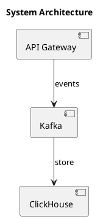
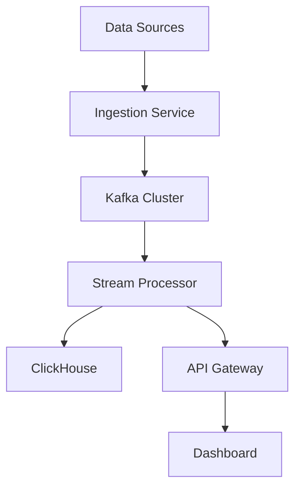

# Documentation

## Overview

The docs directory serves as the central documentation hub for the Real-Time Market Intelligence Platform. This directory contains comprehensive technical documentation, architecture diagrams, API references, deployment guides, and user documentation to support developers, operators, and end users.

## Purpose

This documentation system provides:

- **Technical Documentation**: Architecture, design decisions, and implementation details
- **API References**: Complete endpoint documentation with examples
- **Deployment Guides**: Instructions for various deployment scenarios
- **User Guides**: End-user documentation and tutorials
- **Architecture Diagrams**: Visual representations of system components and data flows
- **Development Guidelines**: Standards and best practices for contributors

## Documentation Structure

```
docs/
├── architecture/           # System architecture documentation
│   ├── overview.md        # High-level architecture overview
│   ├── data-flow.md       # Data flow and processing pipelines
│   ├── microservices.md   # Microservices architecture details
│   ├── deployment.md      # Deployment architecture
│   └── diagrams/          # Architecture diagrams (PlantUML, Mermaid)
├── api/                   # API documentation
│   ├── rest-api.md        # REST API reference
│   ├── websocket-api.md   # WebSocket API reference
│   ├── authentication.md  # Authentication and authorization
│   ├── rate-limiting.md   # Rate limiting policies
│   └── examples/          # API usage examples
├── deployment/            # Deployment documentation
│   ├── local.md           # Local development setup
│   ├── docker.md          # Docker deployment
│   ├── kubernetes.md      # Kubernetes deployment
│   ├── aws.md             # AWS deployment guide
│   ├── azure.md           # Azure deployment guide
│   └── monitoring.md      # Monitoring and observability
├── user-guide/            # End-user documentation
│   ├── getting-started.md # Quick start guide
│   ├── dashboard.md       # Dashboard user guide
│   ├── alerts.md          # Configuring alerts
│   ├── watchlists.md      # Managing watchlists
│   └── screenshots/       # UI screenshots
├── development/           # Developer documentation
│   ├── setup.md           # Development environment setup
│   ├── coding-standards.md # Coding standards and conventions
│   ├── testing.md         # Testing guidelines
│   ├── ci-cd.md           # CI/CD pipeline documentation
│   └── contributing.md    # Contribution guidelines
├── data-sources/          # Data source documentation
│   ├── alpha-vantage.md   # Alpha Vantage integration
│   ├── yahoo-finance.md   # Yahoo Finance integration
│   ├── twitter.md         # Twitter/X integration
│   └── custom-feeds.md    # Custom data feed integration
├── models/                # ML model documentation
│   ├── lstm-forecasting.md # LSTM model documentation
│   ├── prophet-models.md  # Prophet model documentation
│   ├── sentiment-analysis.md # Sentiment analysis models
│   └── training.md        # Model training procedures
├── troubleshooting/       # Troubleshooting guides
│   ├── common-issues.md   # Common issues and solutions
│   ├── performance.md     # Performance troubleshooting
│   ├── debugging.md       # Debugging techniques
│   └── faq.md             # Frequently asked questions
├── templates/             # Documentation templates
│   ├── adr-template.md    # Architecture Decision Record template
│   ├── feature-spec.md    # Feature specification template
│   └── runbook.md         # Operations runbook template
└── README.md              # This file
```

## Documentation Standards

### Format

- All documentation is written in Markdown format
- Use clear, concise language
- Include code examples where applicable
- Keep sections focused and well-organized
- Use diagrams to illustrate complex concepts

### Naming Conventions

- Use lowercase with hyphens for file names: `my-document.md`
- Use descriptive names that reflect content
- Group related documents in subdirectories

### Structure

Each documentation file should follow this structure:

```markdown
# Title

## Overview
Brief overview of the topic

## Prerequisites
What users need to know or have before proceeding

## Main Content
Detailed documentation sections

## Examples
Practical examples and code snippets

## Troubleshooting
Common issues and solutions

## References
Links to related documentation and external resources
```

## Architecture Documentation

### Creating Architecture Diagrams

We use PlantUML and Mermaid for creating architecture diagrams:

**PlantUML Example:**


**Mermaid Example:**


### Architecture Decision Records (ADRs)

All significant architectural decisions should be documented using ADRs:

1. Copy the ADR template from `templates/adr-template.md`
2. Number it sequentially (e.g., `adr-001-kafka-as-message-broker.md`)
3. Document the context, decision, and consequences
4. Place in `architecture/decisions/` directory

## API Documentation

### REST API Documentation Format

Each API endpoint should be documented with:

```markdown
### GET /api/v1/market/{symbol}

Retrieve real-time market data for a specific symbol.

**Parameters:**
- `symbol` (string, required): Asset symbol (e.g., "AAPL")
- `interval` (string, optional): Data interval ("1m", "5m", "1h", "1d")

**Request Example:**
```bash
curl -X GET "https://api.example.com/v1/market/AAPL?interval=5m" \
  -H "Authorization: Bearer YOUR_API_KEY"
```

**Response Example:**
```json
{
  "symbol": "AAPL",
  "price": 150.25,
  "volume": 1000000,
  "timestamp": "2025-09-29T22:54:00Z",
  "change_percent": 2.5
}
```

**Error Codes:**
- `400`: Invalid parameters
- `401`: Unauthorized
- `404`: Symbol not found
- `429`: Rate limit exceeded
```

## Deployment Documentation

### Deployment Guide Template

Each deployment guide should include:

1. **Prerequisites**: System requirements, accounts, credentials
2. **Environment Setup**: Configuration and preparation steps
3. **Deployment Steps**: Detailed step-by-step instructions
4. **Verification**: How to verify successful deployment
5. **Monitoring**: Monitoring and logging setup
6. **Troubleshooting**: Common deployment issues
7. **Rollback**: How to rollback if needed

## User Documentation

### User Guide Best Practices

- Start with the most common use cases
- Use screenshots to illustrate UI interactions
- Provide step-by-step instructions
- Include tips and best practices
- Address common questions and issues

### Screenshot Guidelines

- Use consistent resolution (1920x1080 recommended)
- Highlight important areas with annotations
- Use descriptive filenames
- Store in `user-guide/screenshots/` directory
- Reference in documentation with relative paths

## Development Documentation

### Coding Standards

Document coding standards including:

- Code style and formatting
- Naming conventions
- Error handling patterns
- Testing requirements
- Documentation requirements

### Contributing Guidelines

Provide clear guidelines for contributors:

- How to set up development environment
- Branch naming conventions
- Commit message format
- Pull request process
- Code review expectations

## Maintaining Documentation

### Documentation Updates

- Update documentation alongside code changes
- Review and update quarterly for accuracy
- Archive outdated documentation in `archive/` directory
- Track documentation TODOs in issues

### Documentation Review

- Technical accuracy review by subject matter experts
- Readability review by documentation team
- User testing of tutorials and guides
- Regular audits for broken links and outdated content

## Tools and Resources

### Documentation Tools

- **Markdown Editors**: VSCode with Markdown extensions, Typora
- **Diagram Tools**: PlantUML, Mermaid, Draw.io
- **Screenshot Tools**: Greenshot, Snagit
- **Documentation Generators**: MkDocs, Sphinx, Docusaurus

### Style Guides

- [Google Developer Documentation Style Guide](https://developers.google.com/style)
- [Microsoft Writing Style Guide](https://docs.microsoft.com/style-guide)
- [GitLab Documentation Style Guide](https://docs.gitlab.com/ee/development/documentation/styleguide/)

## Documentation Templates

Common templates available in `templates/` directory:

### Architecture Decision Record (ADR)

Template for documenting architectural decisions:
```markdown
# ADR-XXX: [Title]

## Status
[Proposed | Accepted | Deprecated | Superseded]

## Context
What is the issue that we're seeing that is motivating this decision?

## Decision
What is the change that we're proposing and/or doing?

## Consequences
What becomes easier or more difficult to do because of this change?
```

### Feature Specification

Template for new feature specifications:
```markdown
# Feature: [Name]

## Overview
Brief description of the feature

## User Story
As a [user type], I want [goal] so that [benefit]

## Requirements
### Functional Requirements
- Requirement 1
- Requirement 2

### Non-Functional Requirements
- Performance targets
- Security requirements
- Scalability requirements

## Design
### Architecture
### API Design
### Data Model

## Implementation Plan
1. Phase 1
2. Phase 2

## Testing Strategy
## Deployment Plan
## Risks and Mitigation
```

### Operations Runbook

Template for operational procedures:
```markdown
# Runbook: [Procedure Name]

## Purpose
What this procedure accomplishes

## Prerequisites
What needs to be in place before running this procedure

## Procedure
1. Step 1 with expected outcome
2. Step 2 with expected outcome

## Verification
How to verify the procedure completed successfully

## Rollback
How to undo changes if needed

## Troubleshooting
Common issues and solutions
```

## Quick Links

### For Developers
- [Development Setup](development/setup.md)
- [Coding Standards](development/coding-standards.md)
- [Testing Guidelines](development/testing.md)
- [Contributing Guide](development/contributing.md)

### For Operators
- [Deployment Guides](deployment/)
- [Monitoring Setup](deployment/monitoring.md)
- [Troubleshooting](troubleshooting/)

### For Users
- [Getting Started](user-guide/getting-started.md)
- [Dashboard Guide](user-guide/dashboard.md)
- [FAQ](troubleshooting/faq.md)

### For Architects
- [Architecture Overview](architecture/overview.md)
- [Data Flow](architecture/data-flow.md)
- [Architecture Decisions](architecture/decisions/)

## Contributing to Documentation

Documentation contributions are highly valued:

1. **Identify gaps**: Note missing or unclear documentation
2. **Create an issue**: Document the gap or improvement needed
3. **Write the docs**: Follow the templates and style guides
4. **Submit PR**: Include documentation changes with code PRs
5. **Review**: Participate in documentation reviews

### Documentation Checklist

Before submitting documentation:

- [ ] Content is accurate and up-to-date
- [ ] Follows markdown and style guidelines
- [ ] Includes code examples where applicable
- [ ] Links are valid and working
- [ ] Diagrams are clear and properly formatted
- [ ] Spelling and grammar checked
- [ ] Reviewed by a peer

## Version History

Documentation is versioned alongside code:

- Version 1.0: Initial documentation structure
- Each release includes documentation updates
- Breaking changes are clearly documented

## Support

For documentation questions or issues:

- Open an issue with the `documentation` label
- Contact the documentation team
- Contribute improvements via pull requests

## Future Enhancements

Planned documentation improvements:

- Interactive API documentation with Swagger/OpenAPI
- Video tutorials for common workflows
- Internationalization (i18n) support
- Documentation search functionality
- Automated documentation testing
- Documentation metrics and analytics

## Resources

### External Documentation
- [Apache Kafka Documentation](https://kafka.apache.org/documentation/)
- [ClickHouse Documentation](https://clickhouse.com/docs/)
- [FastAPI Documentation](https://fastapi.tiangolo.com/)
- [React Documentation](https://react.dev/)

### Best Practices
- [Documentation-Driven Development](https://gist.github.com/zsup/9434452)
- [Write the Docs](https://www.writethedocs.org/guide/)
- [Technical Writing Courses](https://developers.google.com/tech-writing)

## Development Status

The documentation system is actively maintained and continuously expanded to cover all aspects of the platform. Documentation is treated as a first-class citizen alongside code, with regular reviews and updates to ensure accuracy and completeness.
